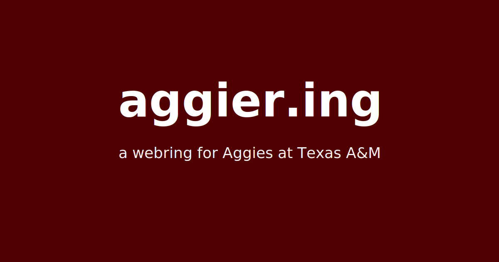

# [aggier.ing](https://aggier.ing)

[What’s a webring?](https://en.wikipedia.org/wiki/Webring)

Howdy! Welcome to an unofficial webring for students and alumni from [Texas A&M University](https://www.tamu.edu/) with personal sites/portfolios.

Want to add your site? Use the **Add your website** form on the [**Add Website** page](https://aggier.ing/add-website) (opens a GitHub pull request for a maintainer to review). If you prefer to edit GitHub yourself, see **Add your website manually** below. You can also add a link to [aggier.ing](https://aggier.ing) on your site so others can find the webring—see **Adding a link to your website** below.

Hope you like it! If you have any questions or feedback, feel free to reach out.

## Add your website manually

If you’re not using the form on [Add Website](https://aggier.ing/add-website), open the file on GitHub and follow these steps. If this is your first time making a PR, no worries—follow these steps.

1. Open [`src/data/webringData.ts`](https://github.com/isaacchacko/aggiering/blob/main/src/data/webringData.ts) in the repository.
2. Press the pencil icon to edit. Without write access, GitHub will fork the repo so you can open a pull request.
3. Add **one** object at the **bottom** of the `webringData` array (keep the trailing comma style consistent with the file).
4. Submit the PR.

Example entry:

```ts
{
  name: "Your Name",
  website: "https://yoursite.com",
  year: "2028",
},
```

| Field | Notes |
|--------|--------|
| `name` | How you want to appear on the hub. |
| `website` | Full `https://` URL to your personal site; it should load for reviewers without a login. |
| `year` | Graduation year as a string (e.g. `"2026"`). |

## Adding a link to your website

Use a normal link to `https://aggier.ing`. To show the webring badge, point an `` at one of the SVGs we host (or copy the file from [`public/`](./public/) in this repo and serve it yourself).

**Hosted badge URLs**

| Variant | URL |
|--------|-----|
| Maroon (default) | `https://aggier.ing/aggiering-maroon.svg` |
| Black | `https://aggier.ing/aggiering-black.svg` |
| White (for dark backgrounds) | `https://aggier.ing/aggiering-white.svg` |

Replace `VARIANT.svg` below with the file you want (`aggiering-maroon.svg`, `aggiering-black.svg`, or `aggiering-white.svg`).

The badge files are square (24×24 viewBox); use equal `width` and `height` so the ring stays round.

### HTML

Use this in static pages, Eleventy/Hugo layouts, or inside Vue/Svelte/Astro/Nuxt templates (swap in your router’s link component if you use one).

```html
<a href="https://aggier.ing" rel="noopener noreferrer">
  
</a>
```

### Markdown

```markdown
[](https://aggier.ing)
```

### Typescript (.tsx)

Works for React, Next.js, Remix, etc. On Next.js you can use `Link` from `next/link` instead of `<a>`; with `next/image`, allow `aggier.ing` in `images.remotePatterns` or stick to `` (simplest for static export / external badges).

```tsx
export function AggieringBadge() {
  return (
    <a href="https://aggier.ing" target="_blank" rel="noopener noreferrer">
      
    </a>
  );
}
```

### Self-hosting the SVG

Download [`aggiering-maroon.svg`](./public/aggiering-maroon.svg) (or black/white) from this repo, place it in your site’s static assets, and set `src` to your own path instead of `https://aggier.ing/...`.

## Maintainer: join form & deployment (Vercel)

The site can open **pull requests automatically** when someone submits the **Add Website** form (`/add-website`). After you **merge** a PR to `main`, your usual **Vercel** production deployment runs as before.

### GitHub token

Create a **fine-grained personal access token** (or use a dedicated bot account) with access limited to this repository:

- **Contents**: Read and write (to commit `src/data/webringData.ts` on a branch)
- **Pull requests**: Read and write (to open the PR)
- **Metadata**: Read (default)

Set in Vercel (and locally if you test the API):

| Variable | Description |
|----------|-------------|
| `GITHUB_TOKEN` | The token secret (never commit it). |
| `GITHUB_REPO_OWNER` | Optional. GitHub org or user that owns the repo (defaults to parsing [`src/lib/site.ts`](./src/lib/site.ts) `GITHUB_REPO`). |
| `GITHUB_REPO_NAME` | Optional. Repository name (same default as above). |

### Cloudflare Turnstile (spam protection)

**Production** requires Turnstile: create a widget in the Cloudflare dashboard and set:

| Variable | Description |
|----------|-------------|
| `TURNSTILE_SECRET_KEY` | Server-side secret for `/api/webring/join` verification. |
| `NEXT_PUBLIC_TURNSTILE_SITE_KEY` | Site key (public) for the client widget. |

For **local development**, you can omit Turnstile keys; verification is skipped when `TURNSTILE_SECRET_KEY` is unset and `NODE_ENV` is `development`.

### Rate limiting (optional, recommended for production)

Without extra configuration, the API uses a **best-effort in-memory** limiter (not reliable across many serverless instances). For consistent limits, provision **Upstash Redis** and set:

| Variable | Description |
|----------|-------------|
| `UPSTASH_REDIS_REST_URL` | From Upstash (or Vercel KV compatible REST URL). |
| `UPSTASH_REDIS_REST_TOKEN` | Matching token. |

The join endpoint allows **5 requests per IP per hour** (sliding window) when Upstash is configured.

### Checks

Run `npm run test` before shipping changes to the join helper (`src/lib/webringFileEdit.ts`, validation, or API).
